# The Big Picture

We can think of a neural network (NN) as a mathematical function which takes an input data $x$ and computes an output $y$:
$y = f_{NN} (x)$

For example, a model trained to identify spam emails takes in an email as input data $x$, and output 0 or 1 indicating whether the email is spam.

The function $f_{NN}$ has a particular form: it’s a nested function. In lecture, we learnt the concepts of network layers. So, for a 3-layer neural network that returns a scaler, $f_{NN}$ looks like this:
$$y = f_{NN} (x) = f_3(f_2(f_1(x)))$$

In the above equation, $f_1$ and $f_2$ are vector functions of the following form:
$$f_l(z) = g_l(W_l \cdot z + b_l)$$

where $l$ is called the layer index. The function $g_l$ is called an activation function (e.g. ReLU, Sigmoid). The parameters $W_l$ (weight matrix) and $b_l$ (bias vector) for each layer are learnt using gradient descent by optimizing a particular loss function depending on the task.

## Understanding the shapes

1. $A_0$ (inputs): Instead of passing each training data (input features of dimension $C_{in}$) we consider a batch of them at once because we are doing the same computation for each of the input features hence ($N \times C_{in}$, where $N$ is batch number)
2. $W_0$ (weight matrix): From lectures, we know the value of each neuron is the affine combination of the input, weight and bias ($W · A + b$ for this multiplication to be compatible, the second dimension of W must match the first dimension of $A$. However this is for a single neuron, for multiple neurons, the first dimension of W should be equal to the number of output neurons Cout hence the shape $C_{out} \times C_{in}$
3. $B_0$ (Biases): From the previous explanation about the weights, we can infer that the bias for a single input feature should be $1 \times 1$, however, since we are considering a batch of N inputs at once, the biases shape become $N \times 1$.
4. $Z_0$: $Z_0$ is the output is the affine combination of input, weights and biases and we require it to be of shape $N × C_{out}$ so that each of the inputs in the batch have their outputs for the number of neurons in $C_{out}$. To see how this works, check example below.
5. $f$: The activation is a linear function and does not change the shape of the input
6. $A_1$: This is the output of the activation function and hence same shape as $Z_0$
7. $Y$: After the activation of the hidden layer, the network can be made deeper by adding several layers. However, the output of the final layer should match your desired output shape, in this case, $C_{out}$ of the final layer is same as the $C_{out}$ of the weight which is equal to the number of neurons because we have just one layer. $C_{out}$ will be the equal to number of neurons in your final layer.

### Example
**Input Layer ($A_0$)**: We have 5 instances in our batch, each represented by a vector of 4 features. Thus, $A_0$ could look like this:

 $$A_0 = 
   \begin{pmatrix}
   0.5 & 0.6 & 0.7 & 0.8 \\
   1.5 & 1.6 & 1.7 & 1.8 \\
   2.5 & 2.6 & 2.7 & 2.8 \\
   3.5 & 3.6 & 3.7 & 3.8 \\
   4.5 & 4.6 & 4.7 & 4.8 \\
   \end{pmatrix}$$

**Weights of the First Layer ($W_0$)**: The weights connecting the input layer to the 6 neurons in the hidden layer form a matrix of shape $6 \times 4$ (since $C_{out} = 6$ and $C_{in} = 4$). Each element $w_{ij}$ represents the weight from the $i^{th}$ neuron to the $j^{th}$ feature of the input. The weight matrix might look something like this:

   $$W_0 = 
   \begin{bmatrix}
   w_{11} & w_{12} & w_{13} & w_{14} \\
   w_{21} & w_{22} & w_{23} & w_{24} \\
   w_{31} & w_{32} & w_{33} & w_{34} \\
   w_{41} & w_{42} & w_{43} & w_{44} \\
   w_{51} & w_{52} & w_{53} & w_{54} \\
   w_{61} & w_{62} & w_{63} & w_{64} \\
   \end{bmatrix}$$
   
**Weighted Sums Before Activation ($Z_0 = A_0 \cdot W_0^T$)**: Multiplying $A_0$ by the transpose of $W_0$ ($W_0^T$) gives us the weighted sums for each neuron in the hidden layer for each instance in the batch. The resulting matrix $Z_0$ will have a shape of $5 \times 6$ because we have 5 instances and 6 neurons:

   $$Z_0 = 
   \begin{bmatrix}
   z_{11} & z_{12} & z_{13} & z_{14} & z_{15} & z_{16} \\
   z_{21} & z_{22} & z_{23} & z_{24} & z_{25} & z_{26} \\
   z_{31} & z_{32} & z_{33} & z_{34} & z_{35} & z_{36} \\
   z_{41} & z_{42} & z_{43} & z_{44} & z_{45} & z_{46} \\
   z_{51} & z_{52} & z_{53} & z_{54} & z_{55} & z_{56} \\
   \end{bmatrix}$$
   
   The first element $z_{11}$ is calculated as:
   $$z_{11} = (0.5 \times w_{11}) + (0.6 \times w_{21}) + (0.7 \times w_{31}) + (0.8 \times w_{41})$$

   Similarly, for $z_{12}$, which represents the weighted sum for the second neuron of the first instance, the calculation would involve the second row of $W_0$:

   $$z_{12} = (0.5 \times w_{12}) + (0.6 \times w_{22}) + (0.7 \times w_{32}) + (0.8 \times w_{42})$$

   And so on for each element in $Z_0$.

**Biases of the First Layer ($B_0$)**: Let's assume the biases for the 6 neurons are as follows: 

$$B_0 = [1, 2, 3, 4, 5, 6]$$

**Adding Biases Using Broadcasting ($Z_0 + B_0$)**: When we add $B_0$ to $Z_0$, broadcasting expands $B_0$ to match the shape of $Z_0$. The operation looks like this:

   $$\begin{bmatrix}
   z_{11}+1 & z_{12}+2 & z_{13}+3 & z_{14}+4 & z_{15}+5 & z_{16}+6 \\
   z_{21}+1 & z_{22}+2 & z_{23}+3 & z_{24}+4 & z_{25}+5 & z_{26}+6 \\
   z_{31}+1 & z_{32}+2 & z_{33}+3 & z_{34}+4 & z_{35}+5 & z_{36}+6 \\
   z_{41}+1 & z_{42}+2 & z_{43}+3 & z_{44}+4 & z_{45}+5 & z_{46}+6 \\
   z_{51}+1 & z_{52}+2 & z_{53}+3 & z_{54}+4 & z_{55}+5 & z_{56}+6 \\
   \end{bmatrix}$$

**Activation Function ($f$)**: We apply a ReLU (Rectified Linear Unit) activation function to each element of the weighted sum matrix $Z_0$. The ReLU function outputs the input value if it is positive and 0 if it is negative. This does not change the shape of the matrix but alters its values. For example, if the weighted sum matrix $Z_0$ after adding biases looked like this:

$$\begin{bmatrix}
-1 & 2 & -3 & 4 & -5 & 6 \\
7 & -8 & 9 & -10 & 11 & -12 \\
-13 & 14 & -15 & 16 & -17 & 18 \\
19 & -20 & 21 & -22 & 23 & -24 \\
-25 & 26 & -27 & 28 & -29 & 30 \\
\end{bmatrix}$$

Applying the ReLU activation function would give us:

$$A_1 = f(Z_0) = \text{ReLU}(Z_0) =
\begin{bmatrix}
0 & 2 & 0 & 4 & 0 & 6 \\
7 & 0 & 9 & 0 & 11 & 0 \\
0 & 14 & 0 & 16 & 0 & 18 \\
19 & 0 & 21 & 0 & 23 & 0 \\
0 & 26 & 0 & 28 & 0 & 30 \\
\end{bmatrix}$$

**Output of the Activation Function ($A_1$)**: The output matrix $A_1$ retains the same shape as $Z_0$ but with the ReLU function applied element-wise. Negative values are replaced with 0, while positive values remain unchanged. In our example, $A_1$ looks like this:

$$A_1 =
\begin{bmatrix}
0 & 2 & 0 & 4 & 0 & 6 \\
7 & 0 & 9 & 0 & 11 & 0 \\
0 & 14 & 0 & 16 & 0 & 18 \\
19 & 0 & 21 & 0 & 23 & 0 \\
0 & 26 & 0 & 28 & 0 & 30 \\
\end{bmatrix}$$

**Final Output ($Y$)**: Assuming this is the final layer or we have a single-layer network, the output $Y$ is the same as $A_1$. For multi-layer networks, further layers would transform $A_1$ accordingly, with the final layer's output shape matching the desired output shape, which in this case is determined by the number of neurons in the final layer ($C_{out}$).

# Neural Networks Overview

In this overview, we explore the functionality of neural networks and their capability to model complex relationships, such as varying drug efficacy based on dosage, beyond simple linear fits.

## What is a Neural Network?

Neural networks consist of interconnected layers of nodes or neurons, where each connection represents a parameter (weight or bias) that the network learns during training.

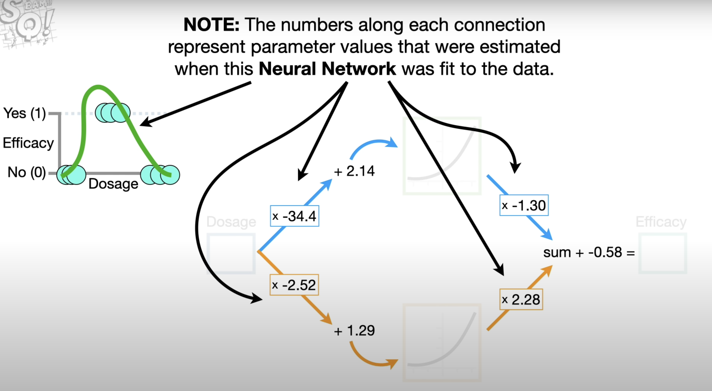

Initially, these parameters are unknown and are determined through a process called backpropagation, fine-tuning them to fit the training data accurately.

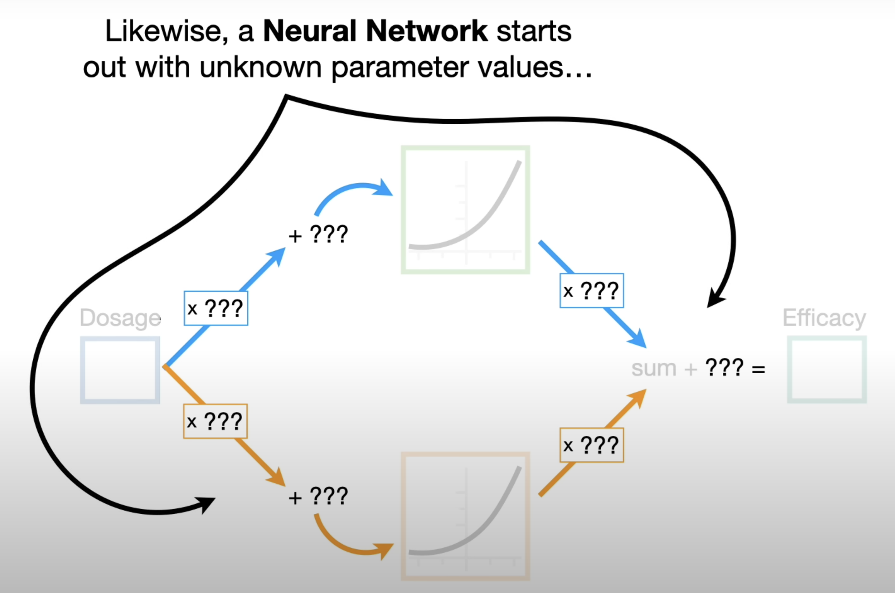 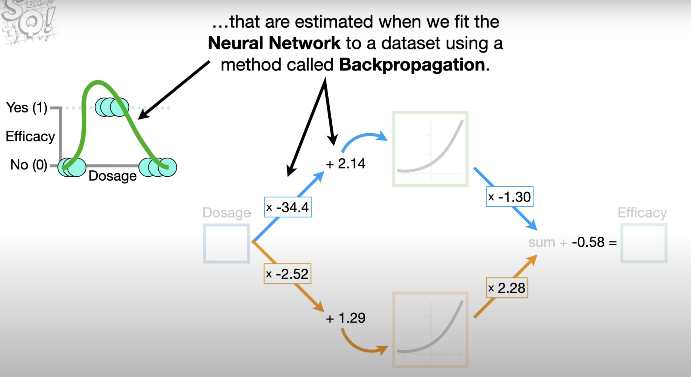

In the next part of this series, we will delve deeper into how backpropagation works, but for now, let's assume we have a neural network already trained for our dataset.

### Activation Functions

Within the network, some nodes incorporate activation functions, depicted by curved lines, essential for introducing non-linearity into the model.

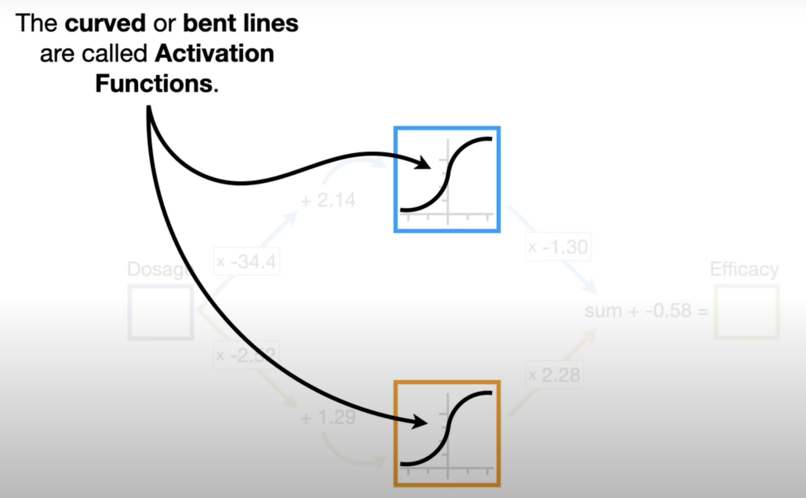

### Hidden Layers

Hidden layers lie between the input and output layers. The configuration of these layers, including the number of nodes and layers, is crucial in designing a neural network.

### Model Construction

We'll examine how neural networks utilize activation functions in hidden layers to create and combine various shapes, ultimately fitting a complex model to the data, illustrated by a green squiggle in our example. In this neural network, we have one input node which is dosage, one hidden layer with 2 nodes and one output node which is efficacy.

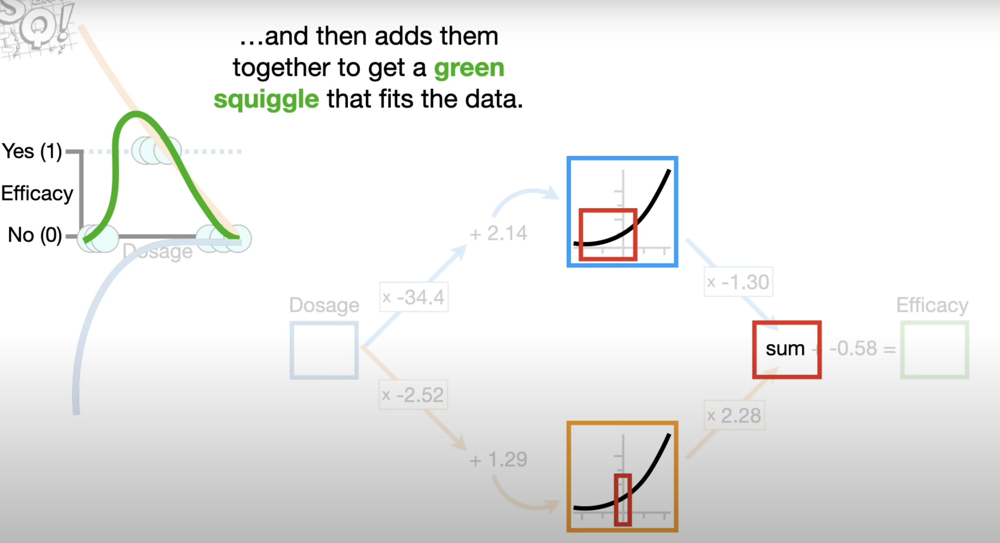

#### Dosage and Efficacy Example

Considering a scenario modeling drug efficacy from dosage, we input dosage values into the network, transforming them through layers and activation functions to predict efficacy.

For the lowest dosage (0), the calculation through one path in the network might look like this:

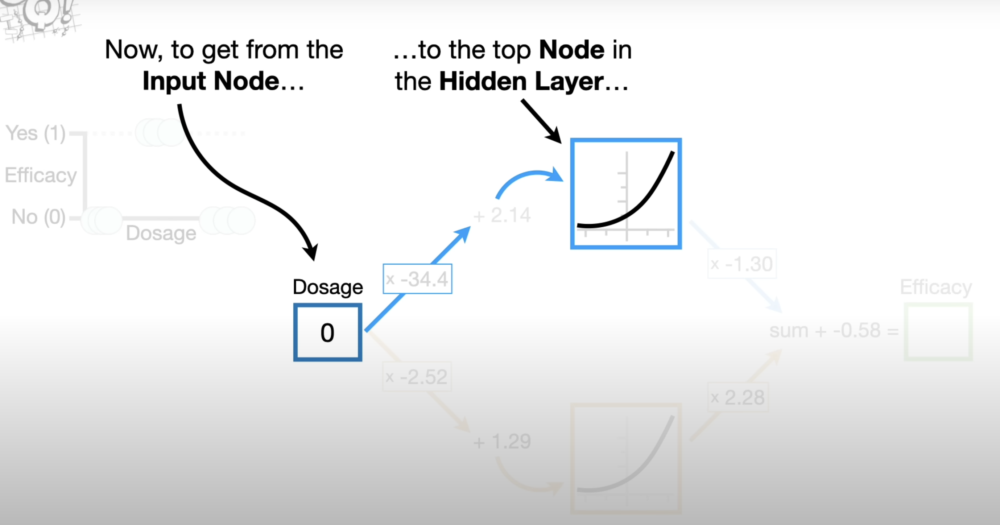

$(\text{Dosage} \times -34.4) + 2.14 = \text{x-axis coordinate}$

$(0 \times -34.4) + 2.14 = 2.14$

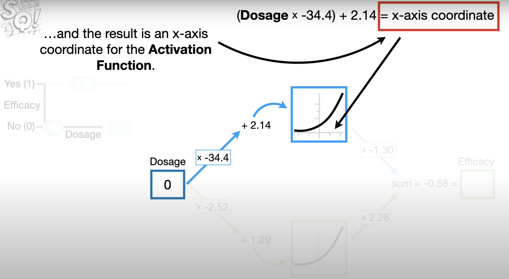

By applying the softplus activation function, we plot a point on the curve for the corresponding dosage, creating a series of points that form a curve as we vary the dosage from 0 to 1.

 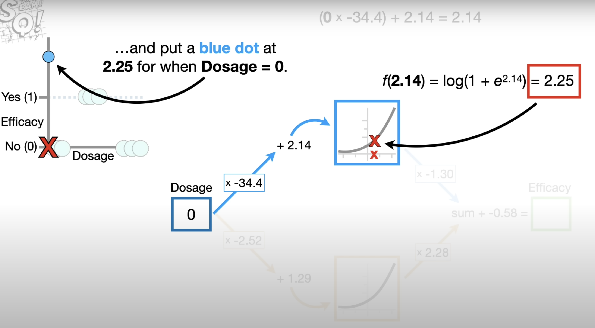

The choice of activation function affects the shape of the curve. For instance, using a sigmoid function would yield a different curve.

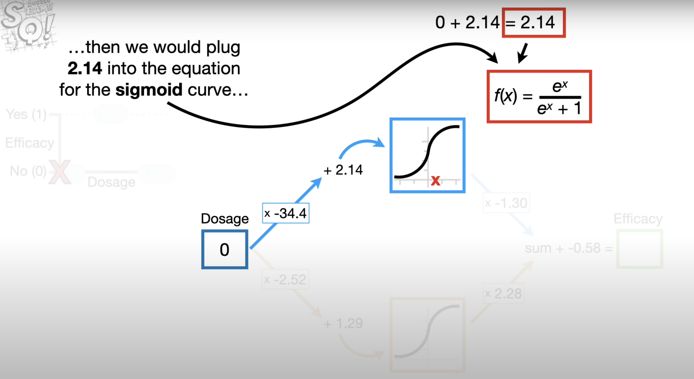

As we increase the dosage to 1, we obtain a curve that represents the model's predictions over the dosage range.

The range of values from the activation function is relatively narrow, corresponding to the red box in the graph, shaping the curve.

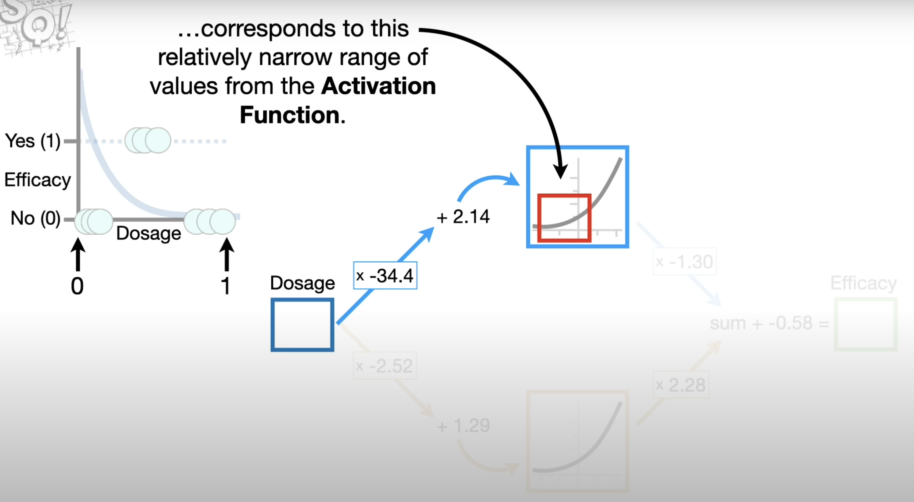

Scaling and transforming these curves through weights and biases in the network allows us to fit complex models to the data. For example, when dosage = 0, the current y-axis coordinate for the blue curve is 2.25, then 2.25*-1.3 = -2.93 which corresponds to this position on the y-axis. And we end up with a new blue curve.

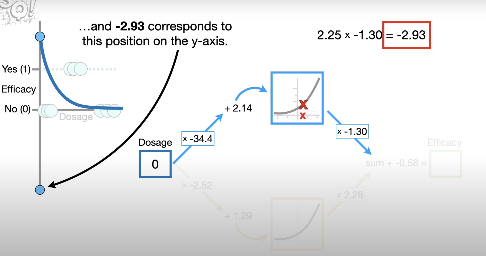 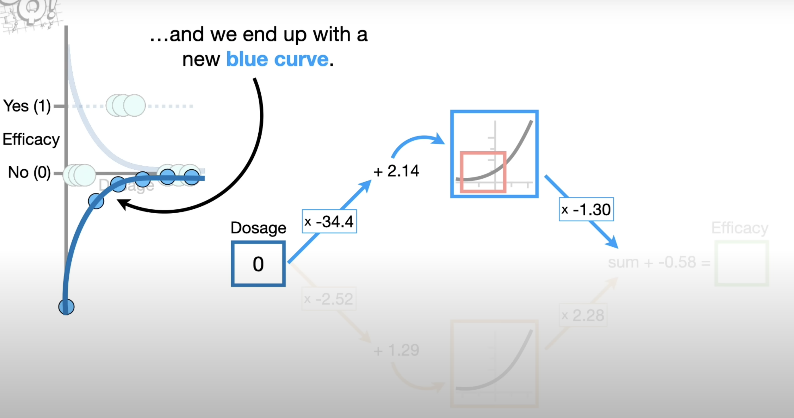

Each node in the hidden layer contributes to the final model by creating unique shapes through the activation function, transformed by the network's parameters.

  

By scaling and adding these curves together, neural networks can approximate complex relationships within the data.

 

### Making Predictions

Given a specific dosage, the neural network can predict its efficacy by mapping it onto the final model curve, indicating the drug's effectiveness. If someone comes along and says that they are using dosage = 0.5 we can look at the corresponding y-axis coordinate on the green squiggle and see that the dosage will be effective or we can solve for the y-axis coordinate by plugging dosage = 0.5 into the neural network and do the math. And we see that the y-axis coordinate on the green squiggle is 1.03, and since 1.03 is closer to 1 than 0, we will conclude that a dosage = 0.5 is effective.

### Understanding Weights and Biases

Weights and biases are the parameters that neural networks adjust to fit the model to the data, slicing, flipping, and stretching the activation functions into new shapes.

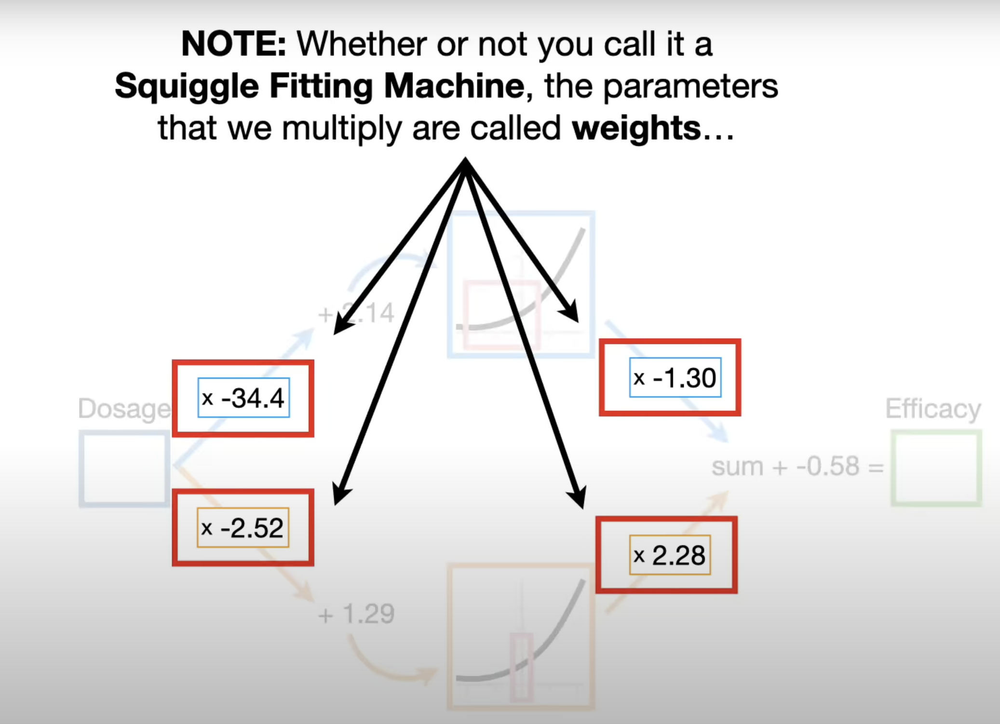 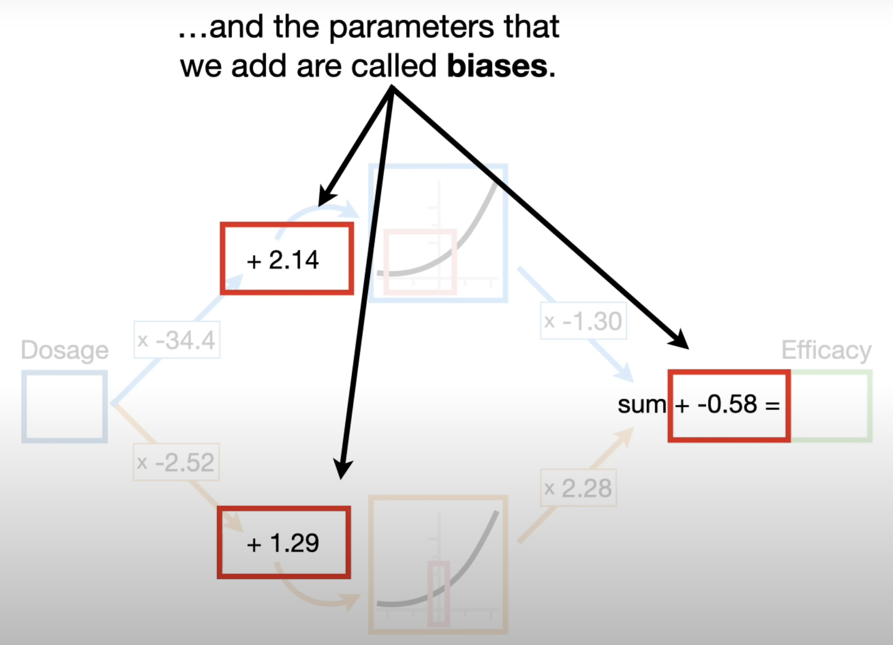

Neural networks can adapt to fit nearly any dataset by manipulating these parameters, showcasing their versatility and power.

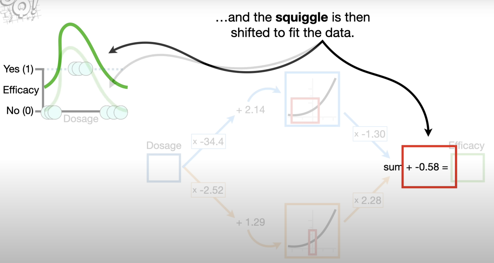 

## Reference:

For a more detailed exploration, watch the related video on [YouTube](https://www.youtube.com/watch?v=CqOfi41LfDw).

# Neural Networks Overview

We will learn about what neural networks do and how they do it.
For example, different dosages will have different efficacy, and we can not just fit a line for the dataset. But even if we have a really complicated dataset like this, a neural network can fit a squiggle to it.

## What is a Neural Network?

A neural network is composed of layers of nodes, with connections between these nodes. The values along each connection represent the parameters of the network, which are estimated during the training process.

For now, just know that these parameter estimates are analogous to the slope and intercept values that we solve for when we fit a straight line to data. 

Initially, the parameter values of a neural network are unknown. These values are determined through a process called backpropagation, which adjusts the parameters to fit the network to the training data.

 

And we will talk about how backprogagation estimates these parameters in part2 in this series, but for now, just assume that we’ve already fit this neural network to this specific dataset and that means we have already estimated these parameters. 

### Activation Function

Also, you may have noticed that some of the nodes have curved lines inside of them, the curved or bent lines are called activation functions. When you build a neural network, you have to decide which activation function or functions you want to use.

### Hidden Layers

The layers between the input and output layers are known as hidden layers. The configuration of these layers—how many there are and how many nodes they contain—is one of the initial design decisions when constructing a neural network.

### Constructing the Model

Let’s learn how this neural network creates new shapes from the curved or bent lines in the hidden layer and then adds them together to get a green squiggle that fits the data. Note in this neural network, we have one input node which is dosage, one hidden layer with 2 nodes and one output node which is efficacy.

#### Example: Dosage and Efficacy

Consider a scenario where we model the efficacy of a drug based on its dosage, ranging from 0 (low) to 1 (high). The neural network takes the dosage value, applies transformations through the network's parameters and activation functions, and outputs an efficacy prediction.

Note: To keep the math simple, let’s assume dosages go from 0(low) to 1(high).

The first thing we are going to do is plug the lowest dosage 0 into the neural network. Now, to get from the input node to the top node in the hidden layer, this connection multiplies the dosage by -34.4 and then adds 2.14 and the result is an x-axis coordinate for the activation function.

$(\text{Dosage} \times -34.4) + 2.14 = \text{x-axis coordinate}$

$(0 \times -34.4) +2.14 = 2.14$

To get the corresponding y-axis value, we plug 2.14 into the activation function, which, in this case, is the softplus function. Then we put a blue dot at 2.25 for dosage = 0.

 

Note, if we had chosen the sigmoid curve for the activation function, then we would plug 2.14 into the equation for the sigmoid curve.

And if we continue to increase the dosage values all the way to 1(the maximum dosage), we get this blue curve.

Note, the full range of dosage values, from 0 to 1 corresponds to this relatively narrow range of values from the activation function. When we plug dosage values, from 0 to 1 into the neural network, and then multiply them by -34.4 and add 2.14, we only get x-axis coordinates that are within the red box and thus, only the corresponding y-axis values in the red box are used to make this new blue curve.

Now we scale the y-axis values for the blue curve by -1.30. For example, when dosage = 0, the current y-axis coordinate for the blue curve is 2.25, then 2.25*-1.3 = -2.93 which corresponds to this position on the y-axis. And we end up with a new blue curve.

 

Now let’s focus on the connection from the input node to the bottom node in the hidden layer. Remember, for -2.52 and 1.29, these values come from fitting the neural network to the data with back propagation, and we’ll talk about that in part2 in this series.

Then same operation as before, we get this orange curve.

So we see that fitting a neural network to data gives us different parameter estimates on the connections and results in each node in the hidden layer using different portions of the activation functions to create these new and exciting shapes.

  

Now just like before, we scale the y-axis coordinates on the orange curve. Only this time, we scale by a positive number 2.28, and that gives us this new orange curve.

Now the neural network tells us to add the y-axis coordinates from blue curve to the orange curve, and that gives us this green squiggle.

Then finally we subtract 0.58 from the y-axis values on the green squiggle and we have a green squiggle that fits the data.

### Predictions

Now if someone comes along and says that they are using dosage = 0.5 we can look at the corresponding y-axis coordinate on the green squiggle and see that the dosage will be effective or we can solve for the y-axis coordinate by plugging dosage = 0.5 into the neural network and do the math. And we see that the y-axis coordinate on the green squiggle is 1.03, and since 1.03 is closer to 1 than 0, we will conclude that a dosage = 0.5 is effective.

### Weights and Biases

The parameters that we multiply are called weights and the parameters that we add are called biases.

 

Note, this neural network starts with two identical activation functions, but the weights and biases on the connections slice them, flip them and stretch them into new shapes, which are then added together to get a squiggle that is entirely new, and the squiggle is then shifted to fit the data.

In theory, neural networks can fit a green squiggle to just about any dataset, no matter how complicated!

## Reference:
- [Watch the video on YouTube](https://www.youtube.com/watch?v=CqOfi41LfDw)
