# Decision Trees

## Overview
In general, a decision tree makes a statement and then makes a decision based on whether or not that statement is true or false. When a decision tree classifies things into categories, it is called a classification tree. And when a decision tree predicts numeric values, it's called a regression tree.

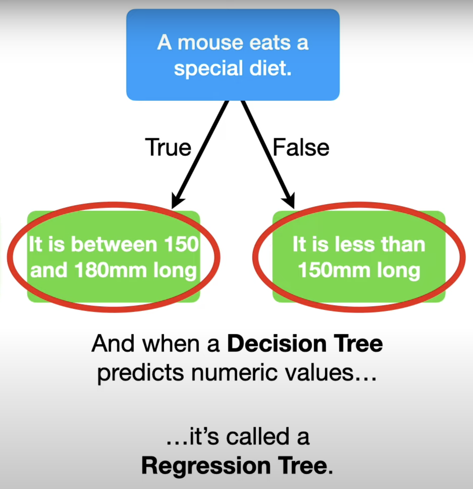

## Root Node
The very top of the tree is called the root node or just the root.

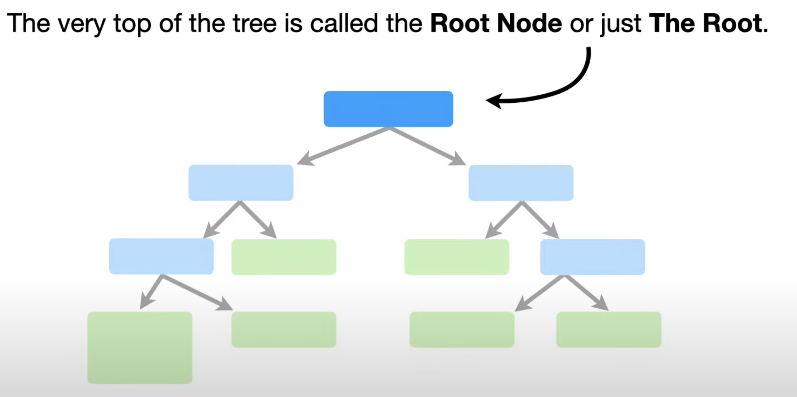

## Internal Nodes
These are called internal nodes, or branches. Branches have arrows pointing to them, and they have arrows pointing away from them.

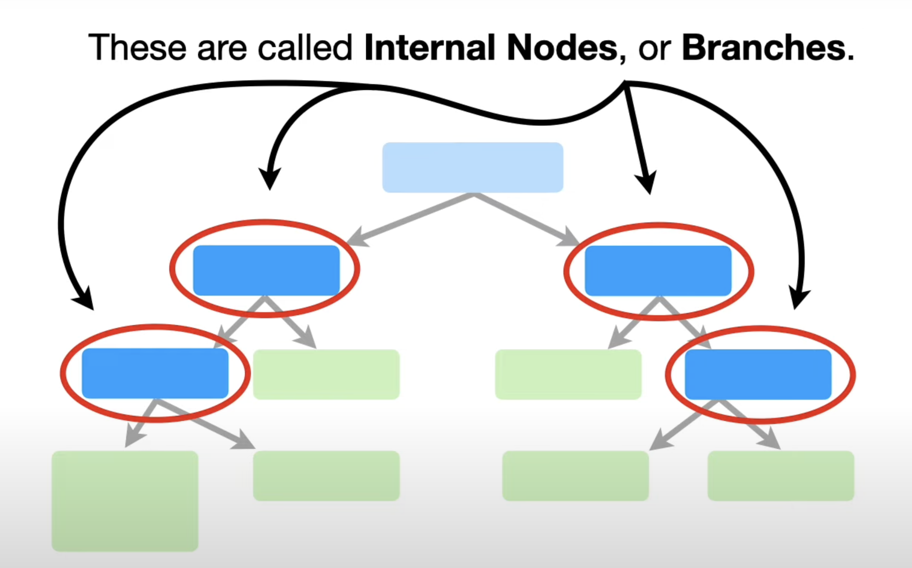

## Leaf Nodes
Lastly, these are called leaf nodes or just leaves. Leaves have arrows pointing to them, but there are no arrows pointing away from them.

## Impurity
Because these three leaves all contain a mixture of people who do and do not love "Cool as Ice," they are called **impure**.

## Gini Impurity
There are several ways to quantify the impurity of the leaves. One of the most popular methods is called Gini impurity, but there are also fancy-sounding methods like entropy and information gain. However, numerically, the methods are all quite similar, so we will focus on Gini impurity since not only is it very popular, but I think it is the most straightforward.

### Calculating Gini Impurity for "Loves Popcorn"
To calculate the Gini impurity for "Loves Popcorn," we start by calculating the Gini impurity for the individual leaves.

#### Gini impurity for left leaf:
$$
\text{Gini impurity for left leaf} = 1 - (\text{probability of "yes"})^2 - (\text{probability of "no"})^2 \\
= 1 - \left(\frac{1}{1+3}\right)^2 - \left(\frac{3}{1+3}\right)^2 \\
= 0.375
$$

#### Gini impurity for right leaf:
$$
\text{Gini impurity for right leaf} = 1 - (\text{probability of "yes"})^2 - (\text{probability of "no"})^2 \\
= 1 - \left(\frac{2}{2+1}\right)^2 - \left(\frac{1}{2+1}\right)^2 \\
= 0.444
$$

Since the leaf on the left has 4 people in it, and the leaf on the right only has 3 people in it, the leaves do not represent the same number of people. Thus, the total Gini impurity is the weighted average of Gini impurities for the leaves. 

$$
\text{Total Gini impurity} = \left(\frac{4}{4+3}\right) \times 0.375 + \left(\frac{3}{4+3}\right) \times 0.444 \\
= 0.405
$$

So, the Gini impurity for "Loves Popcorn" = 0.405
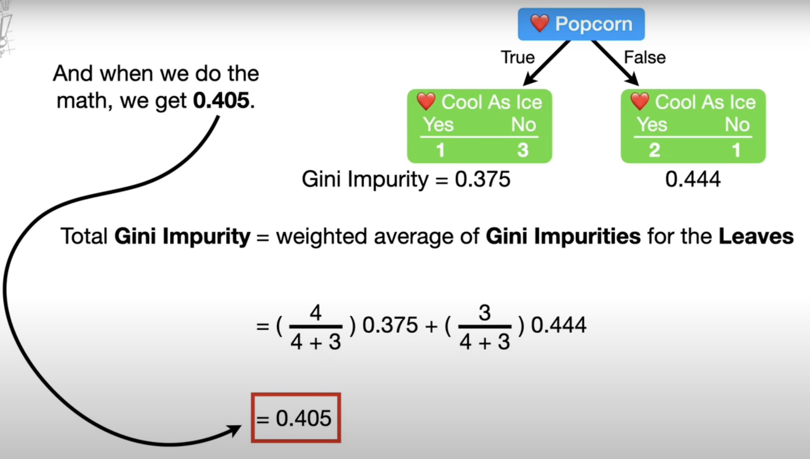

### Gini Impurity for "Loves Soda"
Likewise, the Gini impurity for "Loves Soda" is 0.214

### Calculating Gini Impurity for "Age"
Now we need to calculate the Gini impurity for "Age." However, because "Age" contains numeric data, and not just yes/no values, calculating the Gini impurity is a little more involved.

The first thing we do is sort the rows by age, from lowest value to highest value, then we calculate the average age for all adjacent people. Lastly, we calculate the Gini impurity values for each average age.

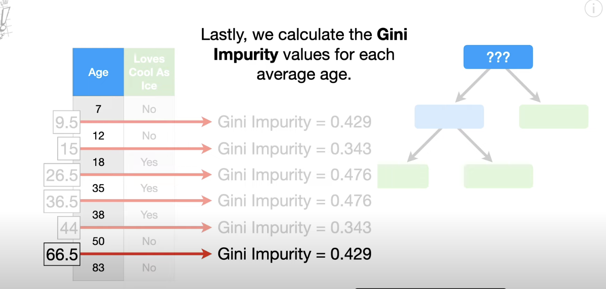

For example, to calculate the Gini impurity for the first value, we put age < 9.5 in the root. 

#### Gini impurity for left leaf:
$$
\text{Gini impurity for left leaf} = 1 - (\text{probability of "yes"})^2 - (\text{probability of "no"})^2 \\
= 1 - \left(\frac{0}{0+1}\right)^2 - \left(\frac{1}{0+1}\right)^2 \\
= 0
$$

We got 0 and this makes sense because every single person in this leaf does not love "Cool as Ice," so there is no impurity.

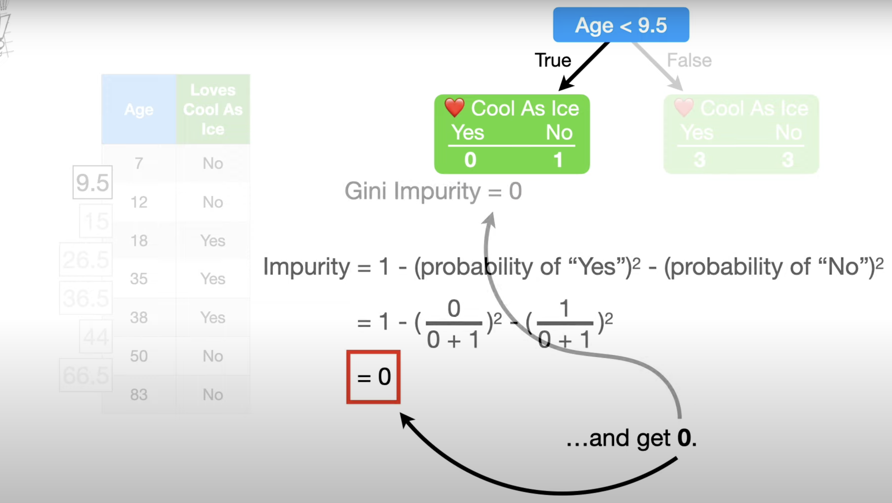

#### Gini impurity for right leaf:
The Gini impurity for the right leaf is 0.5. Now we calculate the weighted average of the two impurities to get the total Gini impurity, which is 0.429.

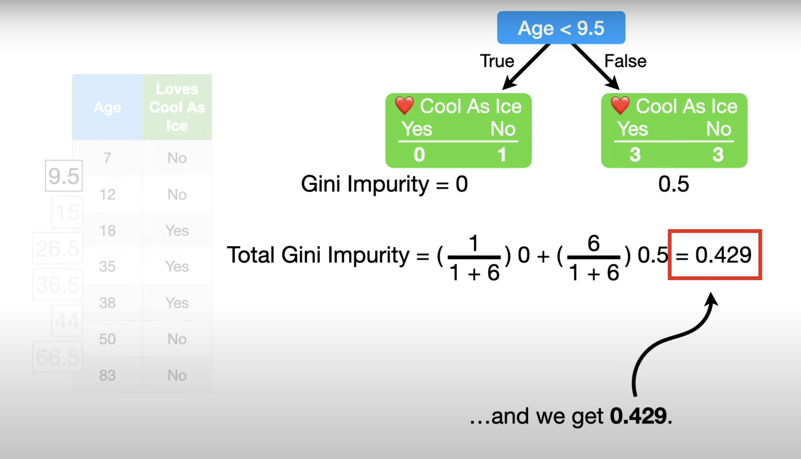

Likewise, we calculate the Gini impurities for all of the other candidate values and these two candidate thresholds, 15 and 44, are tied for the lowest impurity, 0.343. So we can pick either one. In this case, we'll pick 15.

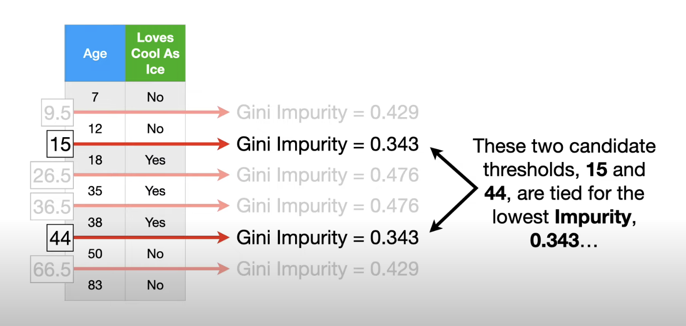

However, remember that we are comparing Gini impurity values for age, "Loves Popcorn," and "Loves Soda" to decide which feature should be at the very top of the tree. Remember that the Gini impurities for them are 0.405, 0.214, and 0.343 separately. Since "Loves Soda" has the lowest Gini impurity, we put "Loves Soda" at the top of the tree.

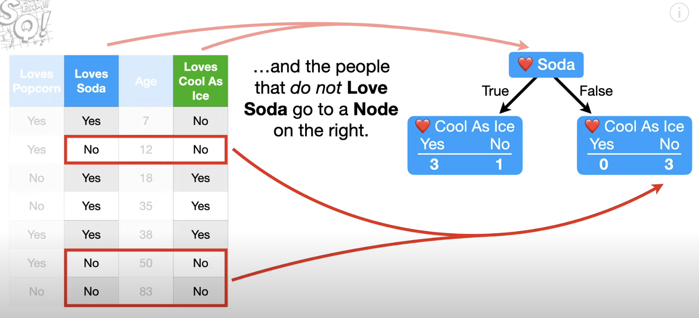

## Node on the Left
Now let's focus on the node on the left. All 4 people that love soda are in this node, 3 of these people love "Cool as Ice" and 1 does not, so this node is impure. So let's see if we can reduce the impurity by splitting the people that love soda based on "Loves Popcorn" or age. We'll start by asking the 4 people that love soda if they also love popcorn. The total Gini impurity for this split is 0.25.

Now we test different age thresholds just like before, only this time we only consider the ages of people who love soda and age < 12.5 gives us the lowest impurity, 0 because both leaves have no impurity at all.

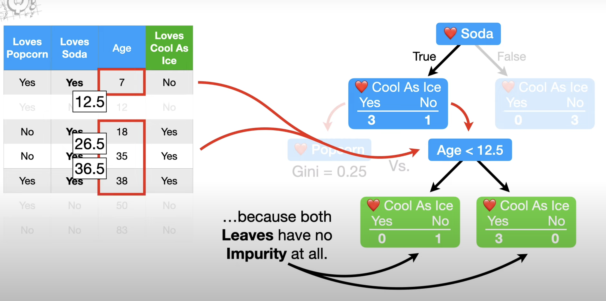

Now because 0 is less than 0.25, we will use age < 12.5 to split this node into leaves.

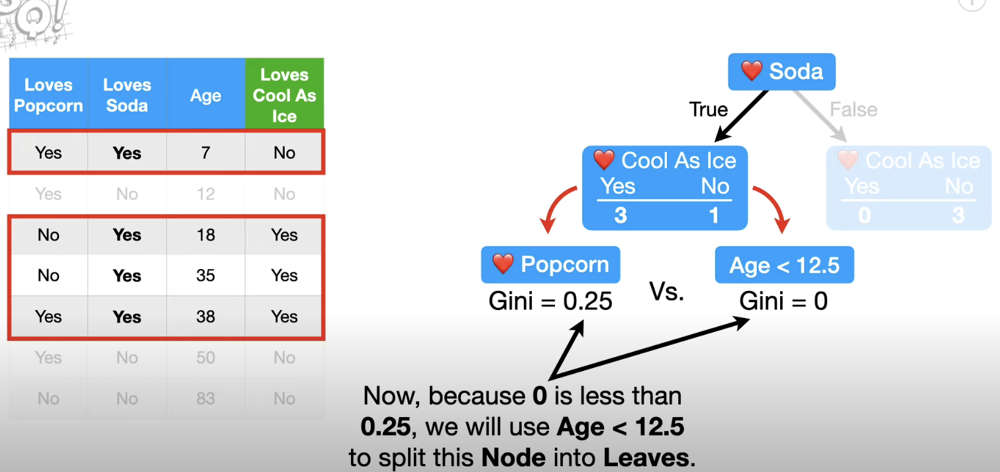

And note that, the arrows point to the leaves because there is no reason to continue splitting these people into smaller groups.

## Assigning Output Values
Then there is just one last thing we need to do before we are done building this tree: we need to assign output values for each leaf. Generally speaking, the output of a leaf is whatever category that has the most votes. So for the leaf where the majority of the people love "Cool as Ice," the output value is "Loves Cool as Ice."

## Handling Overfitting
Lastly, for some technical details, remember when we built this tree only one person in the original dataset made it to this leaf. Because so few people made it to this leaf, it's hard to have confidence that it will do a great job making predictions with future data. And it's possible that we have overfit the data.

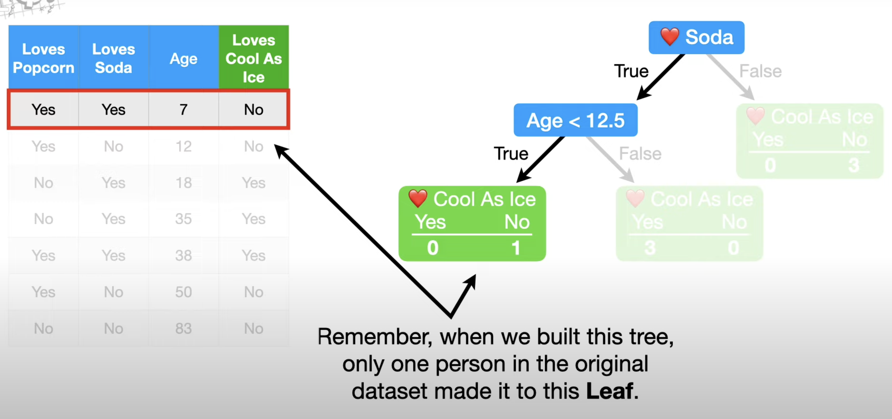

In practice, there are two main ways to deal with this problem: one method is called pruning. Alternatively, we can put limits on how trees grow, for example, by requiring 3 or more people per leaf. Now we end up with an impure leaf, but also a better sense of the accuracy of our prediction because we know that only 75% of the people in the leaf loved "Cool as Ice." Note even when a leaf is impure we still need an output value to make a classification, and since most of the people in this leaf love "Cool as Ice," that will be the output value.

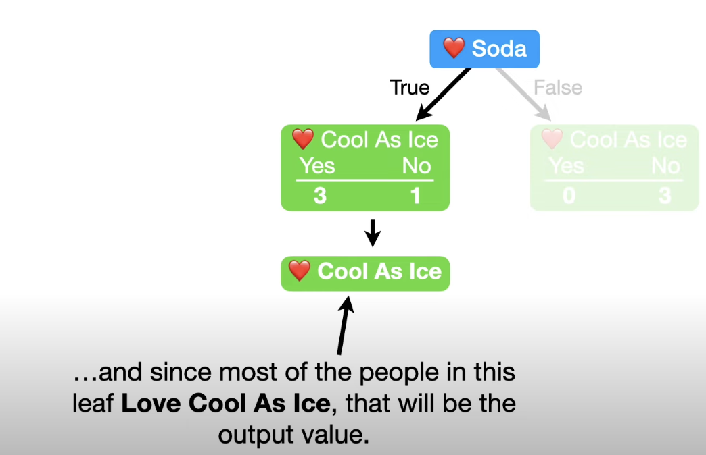

Also note, when we build a tree, we don't know in advance if it is better to require 3 people per leaf or some other number, so we test different values with something called cross-validation and pick the one that works best.
