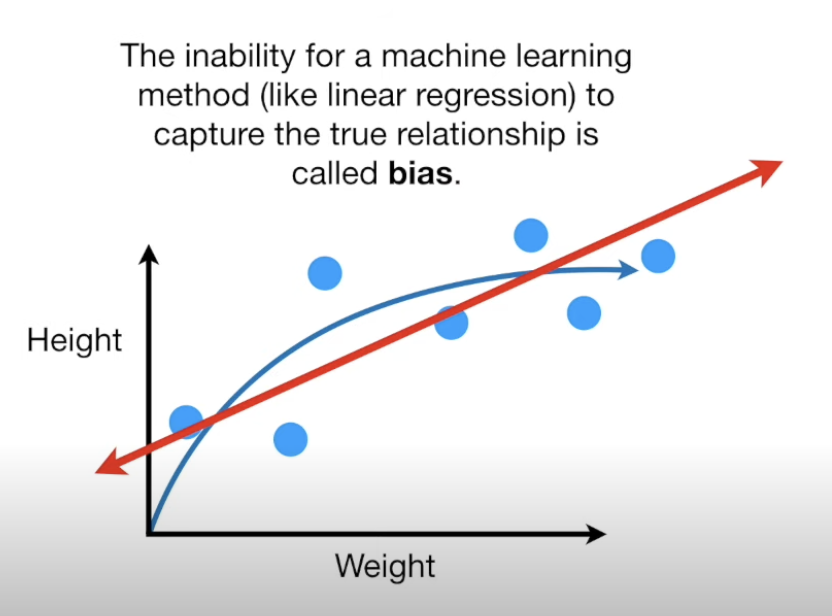
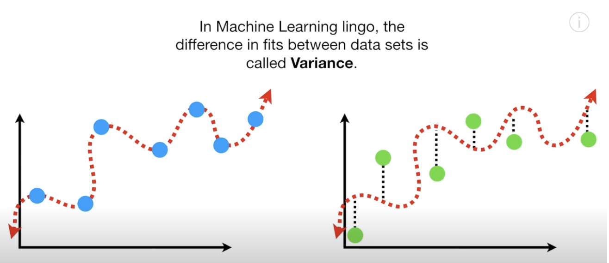
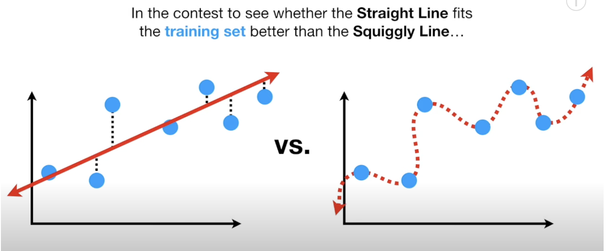
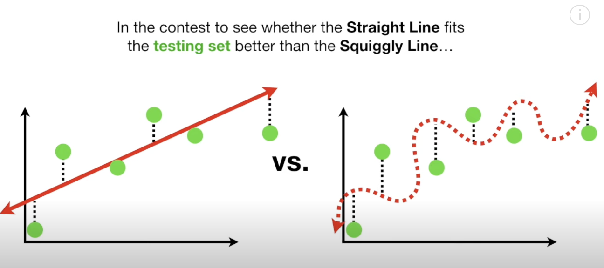

# Bias-Variance Tradeoff in Machine Learning

Model predictions inevitably involve some error. The total prediction error can be broken down into three components: bias, variance, and irreducible error. The formula is:

$$\text{Error} = \text{Bias}^2 + \text{Variance} + \text{Irreducible Error}$$

Irreducible error, as the name suggests, cannot be reduced. It arises from noise inherent in the data. However, bias and variance are aspects we can control and manage.

## Bias

Bias refers to the assumptions made by a model to simplify the learning process. The inability of a model (e.g., linear regression) to capture the true relationship in the data results in bias.

For instance, assuming the data is linear when it's actually quadratic introduces significant bias. A high bias model makes many assumptions, simplifying the model excessively and often leading to underfitting.

## Variance

Variance measures the model's sensitivity to small fluctuations in the training dataset. A high variance model, such as a decision tree before adding constraints, is overly complex and captures noise along with the signal, often resulting in overfitting. A high variance model has too much sensitivity and it will definitely pick up any small differences in the data, so when work with small dataset, variance is a concern.

## Bias-Variance Tradeoff
There is a tradeoff between bias and variance. An overly simple model (high bias) may underfit, failing to capture important patterns. Conversely, an overly complex model (high variance) may overfit, capturing noise instead of the underlying pattern.

### Training vs. Testing Error

If we compare the sum of squares for the training set between a linear line and squiggly line:

- The squiggly line wins on the training set because it can adapt to the data's nuances.

If we compare the sum of squares for the testing set:

- The linear line wins on the testing set because it generalizes better to new data.

The squiggly line has low bias because it is flexible and can adapt to the curve in the relationship between weight and height. However, it also has high variability, resulting in vastly different sums of squares for different datasets. This variability makes it difficult to predict how well the squiggly line will perform with future datasets; it might perform well sometimes but poorly at other times.

In contrast, the straight line has relatively high bias because it cannot capture the curve in the relationship between weight and height. However, it has relatively low variance, as the sums of squares are very similar across different datasets. Therefore, the straight line might not always provide great predictions, but it will consistently give good predictions.

## Methods to Balance Bias and Variance

Three commonly used methods to find the right balance are:
- **Regularization:** Adding a penalty for complexity to the model.
- **Boosting:** Combining weak learners to create a strong learner.
- **Bagging:** Combining predictions from multiple models to reduce variance.

# Underfitting (High Bias) & Overfitting (High Variance)

In the context of machine learning and statistical modeling, understanding the balance between bias and variance is crucial for creating models that predict accurately and generalize well to unseen data. Underfitting and overfitting are two common challenges that occur at opposite ends of this spectrum.

## Underfitting (High Bias)

### Definition:

Underfitting occurs when a model is too simple to capture the underlying structure of the data. Such a model has high bias, making strong assumptions about the data and failing to capture important relationships between features and the target variable.

### Symptoms:

- Poor performance on the training data.
- The model's error rate is similar on both the training and validation datasets, but the error rate is high.
  
### Causes:

- Using a linear model for non-linear data.
- Having insufficient features.
- Overly aggressive regularization.

### Solutions:

- Increase model complexity.
- Add more features or engineer existing ones.
- Reduce regularization parameters.

## Overfitting (High Variance)

### Definition:

Overfitting occurs when a model is too complex and starts to capture not only the underlying structure of the data but also the noise or random fluctuations in the training dataset. Such a model has high variance and may perform exceptionally well on the training data but poorly on new, unseen data.

### Symptoms:

- Exceptionally high performance on the training data.
- A significant drop in performance when tested on a validation dataset.
  
### Causes:

- Using a highly complex model for simple data.
- Training on too few data points.
- Insufficient regularization.

### Solutions:

- Simplify the model.
- Increase the amount of training data.
- Apply regularization techniques.

## Importance of Addressing Underfitting and Overfitting

Balancing bias and variance is key to creating models that are accurate and generalizable. A model that is too biased will miss important patterns, while a model with too much variance will be overly sensitive to fluctuations, potentially capturing noise rather than signal.

## References:
- [Bias-Variance Tradeoff in Machine Learning](https://www.examplelink.com)
