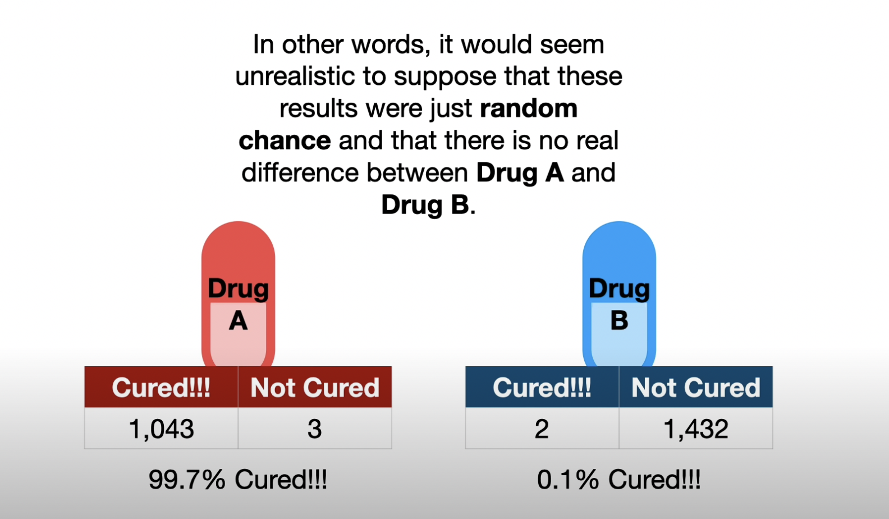
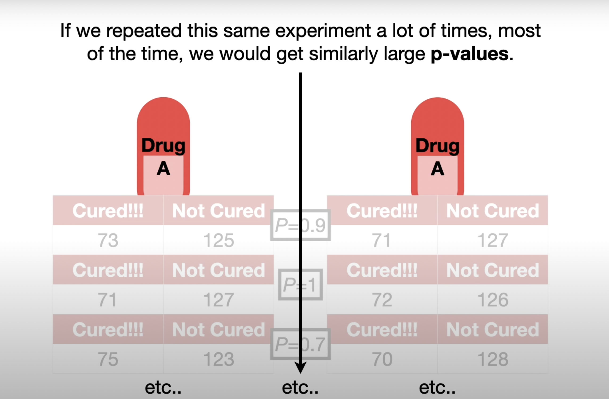

# Understanding P-Value through Drug Efficacy Comparison

Imagine we have two drugs: Drug A and Drug B. We want to know if there's a difference in their efficacy. Let's delve into how we can use p-values to determine this.

## The Problem with Small Sample Sizes

Giving Drug A to one person and Drug B to another, we notice:

- The person who took Drug A was cured.
- The person who took Drug B was not cured.

**Can we conclude that Drug A is better than Drug B?** No!

Reasons for Drug B's failure could vary:

- An opposing effect due to another drug.
- A rare allergy to Drug B.
- Incorrect dosage or usage.
- A placebo effect benefitting Drug A.

Hence, testing on more individuals is necessary.

And for the following test results, it would seem unrealistic to suppose that these results were just random chance and that there is no real difference between Drug A and Drug B.

 

## The Role of P-Values

P-values, ranging between 0 and 1, help quantify the confidence in whether Drug A is different from Drug B. A p-value close to 0 indicates a higher confidence in a difference.

### Common Thresholds for P-Values

- **Standard Threshold:** 0.05  
  - Implies that in an ideal scenario with no drug difference, only 5% of experiments would mistakenly suggest a difference.
- **For Critical Decisions:** Smaller thresholds (e.g., 0.00001)  
  - Reduces the chance of false positives but often at a higher cost or effort.
- **For Less Critical Decisions:** Higher thresholds (e.g., 0.2)  
  - Tolerates more false positives for less critical outcomes.

### Understanding through Examples

1. **Identical Drug, Different Outcomes:**

   With a p-value of 0.9, no significant difference is found. However, sometimes due to random variances like allergies or placebo effects, a smaller p-value (e.g., 0.01) might be observed falsely indicating a difference.
    

3. **False Positives:**

   

   A low p-value like 0.01 in identical groups indicates a false positive.

## P-Value in Our Experiment

If we calculate a p-value for our drug comparison and find it's **less than 0.05**, we'd conclude Drug A is different from Drug B. However, our experiment resulted in a p-value of **0.24**, leading us to believe there's no significant difference between the drugs.

## Hypothesis Testing and Effect Size

Hypothesis testing tries to determine if two conditions (like drugs) are the same or not. The **null hypothesis** assumes no difference. A small p-value doesn't necessarily mean a large difference in effect:

- A large p-value (0.24) might still show a 6-point difference.
- A small p-value (0.04) could indicate a minor 1-point difference.

**In summary**, a small p-value doesn't imply a large difference in effect between Drug A and Drug B.

