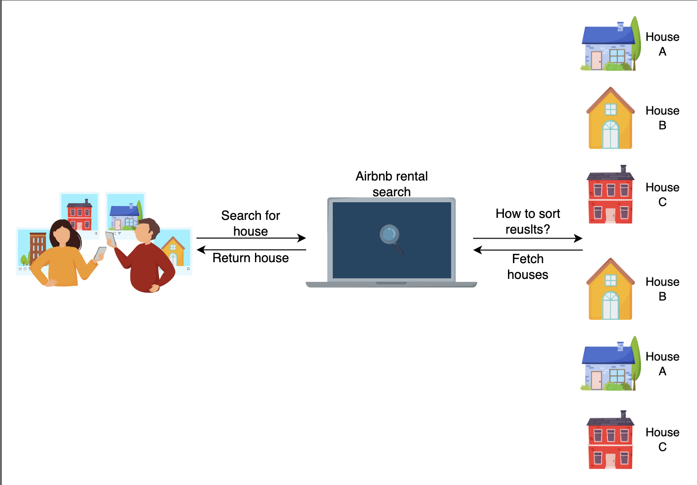

# Airbnb Rental Search Ranking

## 1. Problem Statement

Airbnb users search for available homes at a particular location. The system should sort stays from multiple homes in the search result so that the most frequently booked homes appear on top.

The naive approach would be to craft a custom score ranking function, for example, a score based on text similarity given a query. This wouldn’t work well because similarity doesn’t guarantee a booking.

The better approach would be to sort results based on the likelihood of booking. We can build a supervised ML model to predict booking likelihood. This is a binary classification model, i.e., classify booking and not-booking.

## 2. Metrics Design and Requirements

### Metrics

**Offline Metrics**

- **Discounted Cumulative Gain (DCG):**

  \[
  DCG_p = \sum_{i=1}^{p} \frac{rel_i}{\log_2(i + 1)}
  \]

  where \(rel_i\) stands for the relevance of the result at position \(i\).

- **Normalized Discounted Cumulative Gain (nDCG):**

  \[
  nDCG_p = \frac{DCG_p}{IDCG_p}
  \]

  - **Ideal Discounted Cumulative Gain (IDCG):**

  \[
  IDCG_p = \sum_{i=1}^{|REL_p|} \frac{2^{rel_i} - 1}{\log_2(i + 1)}
  \]

**Online Metrics**

- **Conversion Rate and Revenue Lift:** This measures the number of bookings per number of search results in a user session.

  \[
  conversion\_rate = \frac{number\_of\_bookings}{number\_of\_search\_results}
  \]

### Requirements

**Training**

- **Imbalanced Data and Clear-cut Session:** An average user might do extensive research before deciding on a booking. As a result, the number of non-booking labels has a higher magnitude than booking labels.
- **Train/Validation Data Split:** Split data by time to mimic production traffic. For example, select one specific date to split training and validation data. Use a few weeks of data before that date as training data and a few days of data after that date as validation data.

**Inference**

- **Serving:** Low latency (50ms - 100ms) for search ranking.
- **Under-predicting for New Listings:** Brand new listings might not have enough data for the model to estimate likelihood, potentially leading to under-prediction for new listings.

### Summary

| Type       | Desired Goals                                                       |
|------------|---------------------------------------------------------------------|
| **Metrics**| Achieve high normalized discounted Cumulative Gain metric           |
| **Training**| Ability to handle imbalanced data                                  |
|            | Split training data and validation data by time                     |
| **Inference**| Latency from 50ms to 100ms                                        |
|            | Ability to avoid under-predicting for new listings                  |

